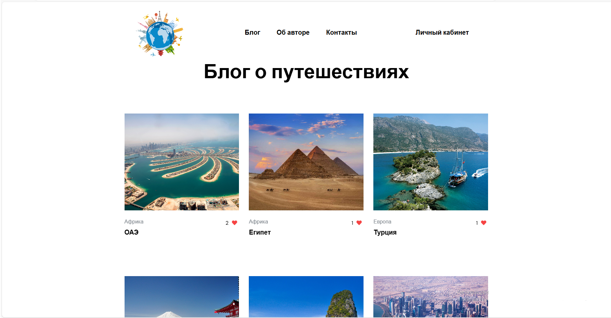
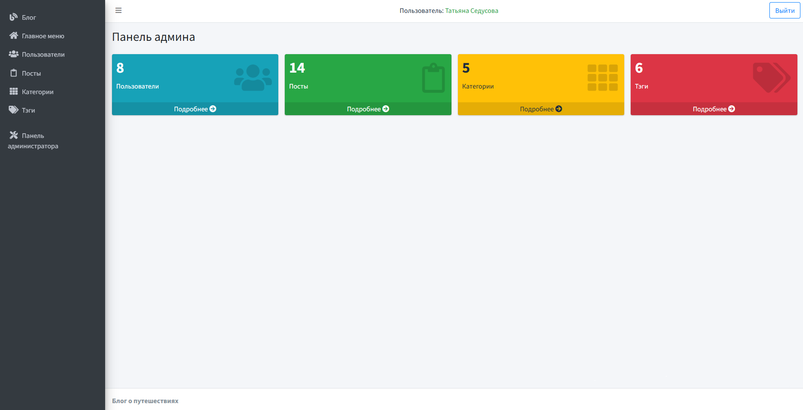

<a href="http://seduso5p.beget.tech">http://seduso5p.beget.tech</a>

# Blog

This is travel blog, written in Laravel 11 and MySQL 8.0.
The goal of this repository is to showcase Laravel development practices with a simple application.

## Basic Features

- Manage users, posts, categories and tags
- Roles: reader and administrator
- Admin panel
- Personal account
- Categorize posts
- Comments and likes
- Visual editor posts

## Preview

